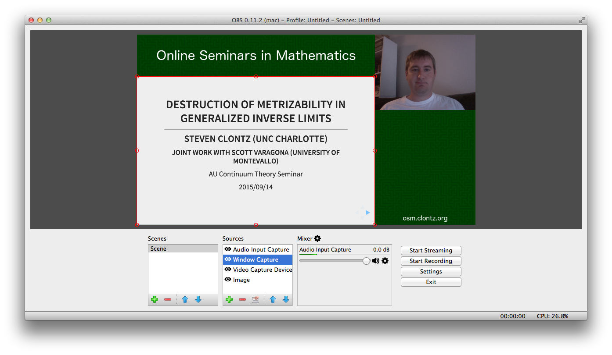

# Online Seminars in Mathematics

<osm.clontz.org>

The OSM project serves to allow mathematical seminars to easily stream their content online to be shared with the larger mathematical community.

This README outlines the personnel, hardware, and software required to produce a stream, as well as the logistics of running the stream.

Interested in getting involved with OSM to help promote open research activity
in mathematics? Email Steven at `steven.clontz+osm@gmail.com`.

## Required Personnel

An OSM stream requires only two people:

* A moderator to set up the equipment and software, to monitor the stream for
  errors, and to moderate questions submitted by the seminar's live and online
  audiences
* A speaker to present a topic relevant to the seminar

OSM streams are designed to support both live and online audiences (so as
to extend the audience of a traditional seminar, not replace it with an
online format).

## Required Hardware/Services

* A relatively recent MacBook (this guide was created using a 2009 MacBook Pro)
  for use by the speaker. In particular, it should have a built-in camera and
  microphone.
* A second device (tablet/laptop) for the moderator.
* A stable Wi-Fi or wired internet connection for both devices
* A projector (and any adapters required to connect the laptop to it)

## Required Software/Accounts

* [Open Broadcaster Software](https://obsproject.com/)'s
  OBS Multiplatform should be installed
  on the speaker's MacBook.
* Both the speaker's MacBook and the moderator's device should have a modern
  web browser such as [Firefox](https://www.mozilla.org/en-US/firefox/)
  or [Chrome](https://www.google.com/chrome/browser/desktop/).
* Whatever software is required to view the talk slides should be installed
  on the speaker's Macbook.
* To customize the OSM banner, install the
  [GNU Image Manipulation Program (GIMP)](http://www.gimp.org/downloads/)
  on the device of your choice.
* The moderator should have an account to use on [YouTube](http://youtube.com),
  for example, a Gmail account.

## Provisioning the stream

The first steps are to set up the "Live Event" on the moderator's YouTube
account. This may be done as far as advance as you like, and from any
computer with a modern browser and internet connection; once this is done,
you can share the link to the stream with others.

#### YouTube settings

* Visit <https://www.youtube.com/my_live_events> and click "New live event".
* Give your event a relevant title, and schedule it for the time your
  seminar runs. The video can be either "Public" (searchable on YouTube) or
  "Unlisted" (available only by sharing the link).
  Make sure you set the "Type" to "Custom". Click "Create event".
* If you have one, you can upload an image relevant to the upcoming talk to
  use as a thumbnail. Otherwise, leave it blank or use the
  [default OSM banner image](https://raw.githubusercontent.com/StevenClontz/osm/master/osm_stream_banner.png).
* Select "Basic ingestion" with "1500 Kbps - 4000 Kbps (720p)"
* Leave the encoder as "Other encoders", and copy down the Stream Name given
  (something like `account.name.g62d-x8z6-v6y9-3849`): you will need this
  to set up OBS Multiplatform on the speaker's Macbook.
* Click "Save changes" at the upper left of the screen. Then copy the URL
  given by the "View on Watch Page" button (something like
  `https://www.youtube.com/watch?v=dQw4w9WgXcQ`):
  this will be the address your viewers can watch the stream on.

#### Banner image

Optionally, you can customize the default OSM banner image which will appear
as the background of your stream along with the speaker and his/her slides.

* Download the
  [default OSM banner template](https://raw.githubusercontent.com/StevenClontz/osm/master/osm_stream_banner.xcf)
  to the computer with GIMP installed, and open it.
* Select the "The Title of the Talk" layer and make it visible. Update
  the text with the title of the talk and the date/time of the seminar.
* "Export as" a PNG file, and save it to the speaker's Macbook.

Otherwise download the default
[OSM banner image](https://raw.githubusercontent.com/StevenClontz/osm/master/osm_stream_banner.png)
to the speaker's Macbook.

#### OBS Settings

Open OBS, and the viewer (e.g. Adobe Acrobat, a web browser)
for the presentation; do not set it to full screen yet.

Add these four AV sources in this order to the Sources list:

* Audio Input Capture (the input from the Macbook microphone)
* Window Capture
    * Select the window containing the talk slides.
* Video Capture Device (the input from the Macbook webcam)
* Image
    * Select the default or customized OSM banner image.

If possible, set the slides to full screen so that it is the right size
for arranging the video sources. Arrange the video sources as seen in the
screenshot below:

Then, set up OBS to send data to YouTube:

* Click "Settings".
* Go to the "Stream" tab and select the following:
    * Service: YouTube
    * Server: Primary YouTube ingest server
    * Stream key: (the key similar to `account.name.g62d-x8z6-v6y9-3849`
      that you copied earlier)
* Go to the "Output" tab and select the following (leaving the rest as default):
    * Output Mode: Simple
    * Video Bitrate: 1500
    * Audio Bitrate: 160
    * Automatically Reconnect: [checked]
    * Retry Delay (seconds): 10
    * Maximum Retries: 20
    * Enable Advanced Decoder Settings: [unchecked]
* Go to the "Video" tab and select the following:
    * Render: OpenGL
    * Base Resolution: 1280x720
    * Scaled Resolution: 1280x720
    * Downscale Filter: Bicubic
    * Common FPS Values: 30

## Running the stream

TODO